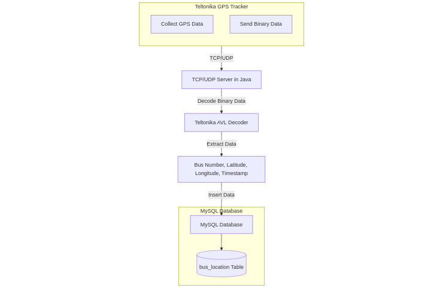

# Bus booking

## Features

Features: 

1) Bus booking

2) Dynamic bus tracking using GPS api , Google api and pitstop/stop updates

3) Cancellation Policy and refund engine

4) ML

I) Dynamic pricing demand of bus type and seat  

II) Driver skill analysis from IOT data using :
a) PIEV model (qualitative test while driver onboarding)
b) Travel time , arrived time and delays (Driver Rating = (D * wD) + (A * wA) + (E * wE))

D = Departure Punctuality Score (0–5)
A = Arrival Punctuality Score (0–5)
E = En Route Behavior Score (Delays) (0–5)
wD, wA, wE = Weights for each factor (e.g., 0.3, 0.5, 0.2).

// finally take average of a and b

// Retain drivers with more than 4+ rating

5) Jira integration for customer support

6) Automatic next bus scheduling in case of bus breakdown (alert to nearest bus stop that need a bus)

7) GPS API to track bus location

8) IOT :

a) Vehicle condition monitoring(fuel,engine,battery,lights) and alert the driver

b) Real-time analysis :
i) Highway traffic / condition / alternate route suggestion
ii) Traffic density
iii) Road capacity per second
iv) Road marking following (bottom sensors)
v) Sign board following (front sensors)
vi) Intersection roads / Train crossings / Flyovers traffic

9) Driver on-boarding , de-boarding , salary management(base pay + no of buses driven/month)

Bus type :

1) Based on Seating - Sleeper / Seater

2) Based on Amenities - AC/Non-AC/ + Primo (wifi , restroom , tv / seat , charging point)

Pit Stop calculation and location based on route and distance :

I) Pitstop rules :

< 200 KM = 1 stop
200-400 KM = 1-2 stops
more than 500 KM = 2-3 stops 

II) Dynamic Pitstop calculation : 

- Calculate potential pitstops based on bus current location and time into the journey.

- Filter pitstop based on proximity and amenities(Food , Restroom).

- Adjusts timing and pitstop recommendations based on live traffic and weather updates.

Time slots :

T1 = 6:30 AM
T2 = 9:00 AM
T3 = 12:30 AM
T4 = 5:30 PM
T5 = 9:30 PM

Luggage policy : 

10 KG/passenger max

API Integration:

1) Google Maps API (for route mapping and distance calculations).

2) OpenWeatherMap API (for weather conditions).

3) Yelp or Zomato API (for pitstop details like restaurants).

4) GPS API for real-time bus tracking

5) HRMS connect for salary management

## GPS API diagram :

